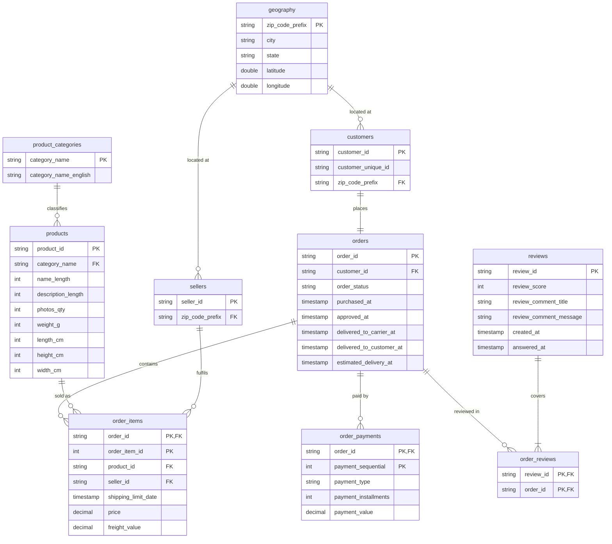

# Silver data model

Normalised model implemented by the silver layer, figures cited below come from profiling
bronze with [`profile_bronze.py`](../ingest/profile_bronze.py).

## Entities

Ten tables in `<catalog>.silver`.

| Table                | Grain                                   | Primary key                    |
| -------------------- | --------------------------------------- | ------------------------------ |
| `geography`          | one Brazilian zip-code prefix           | `zip_code_prefix`              |
| `customers`          | one customer record per order           | `customer_id`                  |
| `sellers`            | one seller                              | `seller_id`                    |
| `product_categories` | one product category                    | `category_name`                |
| `products`           | one product                             | `product_id`                   |
| `orders`             | one order                               | `order_id`                     |
| `order_items`        | one line item within an order           | `order_id, order_item_id`      |
| `order_payments`     | one payment instrument used on an order | `order_id, payment_sequential` |
| `reviews`            | one review                              | `review_id`                    |
| `order_reviews`      | one review-to-order link                | `review_id, order_id`          |

## ERD

Every table also carries `_source` and `_loaded_at`, propagated from bronze.

## Normalisation rationale

**1NF** — the source CSVs are already flat and atomic. The order-to-product many-to-many is
resolved by `order_items`, which is an entity rather than a pure link table because it carries its
own attributes (`price`, `freight_value`, `shipping_limit_date`).

**2NF** — 789 `review_id`s appear against more than one order, with **zero** conflicting scores, so
this is a genuine many-to-many rather than dirty data. Keying a single table on
`(review_id, order_id)` would leave the score and comment dependent on `review_id` alone, so
reviews are split into an entity and an `order_reviews` junction table.

**3NF** — two transitive dependencies are removed. The English category name depends on the
category, not the product, so it moves to `product_categories`. City, state and coordinates depend
on the zip-code prefix, not on the customer or seller, so they move to `geography`, referenced by
both. Derived values — order totals, delivery durations, repeat-purchase flags — are not stored;
they belong in gold.

**Deliberate break** — `customer_unique_id` stays on `customers`. `customer_id` is issued once per
order, so 99,441 customer records represent 96,096 people. A separate `persons` table would be the
strict 3NF move, but no attribute depends on `customer_unique_id` alone (location varies across
orders for 250 people), so it would hold a single column. The grouping happens in gold instead.

## Key strategy and duplicates

Silver uses the source's natural keys: profiling confirmed every primary key above is unique and
non-null in bronze, so a surrogate key would fix nothing here, and natural keys keep silver
traceable back to the raw files. Gold adds deterministic `sha2` hash surrogate keys on the
dimensions, so re-runs reproduce identical keys and facts can be rebuilt independently.

Only one source table contains true duplicates: `geolocation` holds 1,000,163 rows for 19,015 zip
prefixes, of which 261,831 are exactly identical, and is aggregated to one row per prefix (median
coordinates, most common city and state). The repeated `review_id`s and `customer_unique_id`s are
not duplicates — both are resolved by the grains above. Every other table is deduplicated
defensively so that a re-run or a changed source cannot violate its key.
